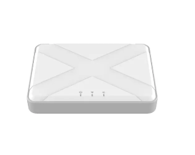

# OWON Zigbee Devices

OWON Technology develops and manufactures professional Zigbee devices for smart homes, smart buildings, commercial automation and IoT applications.

Founded in 1993, OWON is an ISO 9001:2015 certified OEM/ODM manufacturer specializing in Zigbee products, HVAC control, smart energy management and IoT system integration.

Our Zigbee product portfolio includes gateways, thermostats, motion sensors, occupancy sensors, door sensors, temperature sensors, smoke detectors, gas detectors, fall detection sensors and many other smart devices.

---

# Zigbee Product Portfolio

## SEG-X5 Zigbee Gateway

The SEG-X5 is a professional Zigbee gateway designed for commercial IoT deployments.

Key features include:

- Zigbee 3.0
- Ethernet connectivity
- BLE commissioning
- Supports up to 128 Zigbee devices
- Local API
- Smart building integration
- Commercial IoT projects

---

## PCT504 Zigbee Thermostat

Designed for fan coil HVAC control.

Suitable for:

- Hotels
- Apartments
- Office buildings
- Smart HVAC projects

Supports:

- Zigbee 3.0
- Home automation
- Commercial HVAC

---

## THS317 Zigbee Temperature Sensor

A Zigbee temperature and humidity sensor with optional external probe for environmental monitoring.

Applications include:

- Cold chain monitoring
- Refrigeration
- HVAC
- Server rooms
- Industrial monitoring

---

## DWS332 Zigbee Door Sensor

Suitable for:

- Smart home security
- Office access monitoring
- Hotel automation
- Commercial alarm systems

---

## PIR323 Zigbee Motion Sensor

Designed for occupancy detection and intelligent automation.

Typical applications include:

- Smart lighting
- Building automation
- Security systems
- Energy saving

---

# Typical Applications

OWON Zigbee devices are widely used in:

- Smart Homes
- Smart Buildings
- Hotels
- Apartments
- Offices
- Healthcare
- Elderly Care
- Commercial Automation
- Energy Management
- Building Automation Systems

---

# Why Choose OWON

OWON works with:

- OEM brands
- System integrators
- Smart home companies
- Building automation companies
- IoT solution providers
- Security solution providers

Advantages include:

- Zigbee 3.0 products
- OEM & ODM services
- Hardware customization
- Firmware customization
- Gateway and sensor ecosystem
- Commercial deployment experience
- Global distribution

---

# Product Documentation

### SEG-X5

Documentation coming soon.

### THS317

Documentation coming soon.

### DWS332

Documentation coming soon.

### PIR323

Documentation coming soon.

---

# Recommended Reading

Learn more about Zigbee technology:

- Zigbee Gateway Guide
- Zigbee Motion Sensor Guide
- Zigbee Temperature Sensor Guide
- Zigbee Door Sensor Guide

---

# Official Website

Visit the official OWON website:

https://www.owon-smart.com/

---

# Contact

OWON welcomes OEM, ODM, distribution and IoT partnership opportunities worldwide.

Email

sales@owon.com

Website

https://www.owon-smart.com/
